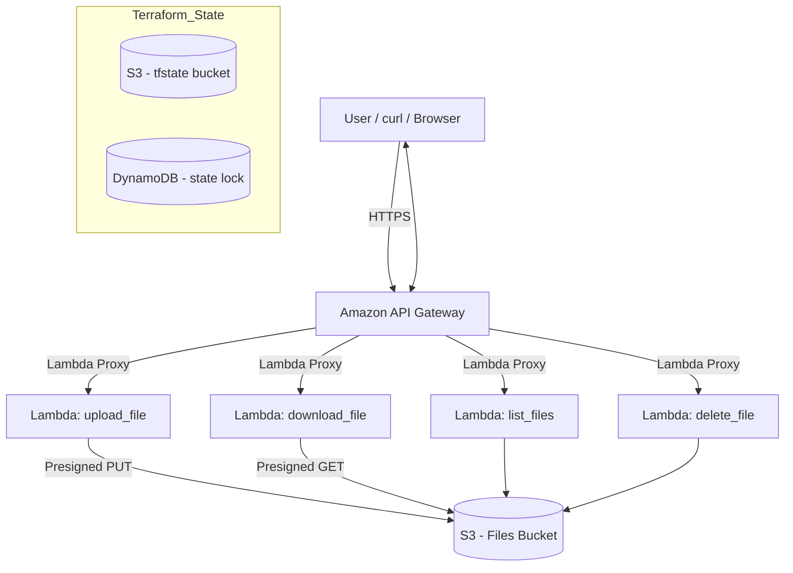

# AWS Multi-Tier Serverless Web App (Terraform + Lambda + API Gateway + S3)

Secure, scalable serverless file manager: upload, download, list, and delete files via **API Gateway → Lambda (Python) → S3**, provisioned with **Terraform**. Terraform state is stored in **S3** with **DynamoDB** locking.

**Tech:** Terraform · AWS Lambda · API Gateway · S3 · DynamoDB · IAM · GitHub Actions 
 
---

## Demo (screenshots)
> Add these files in `/assets` and they’ll appear automatically (instructions below).

<p align="center">
  
  
</p>
<p align="center">
  
  
</p>

---

## Architecture & Project Structure

### Architecture


### Project Structure
```
aws-mtier-terraform/
│
├── infra/
│   ├── main.tf                  # Main Terraform configuration
│   ├── variables.tf             # Input variables
│   ├── providers.tf             # AWS provider configuration
│   ├── backend.hcl              # Backend state config (S3 + DynamoDB)
│   ├── hello.txt                # Test file for Lambda upload/download
│   ├── .terraform.lock.hcl      # Provider version lock
│   └── modules/                 # Networking, compute, and data modules
│
├── .gitignore                   # Ignore .terraform, tfstate, zip files
├── README.md                    # Documentation (this file)
```

 
 
 
