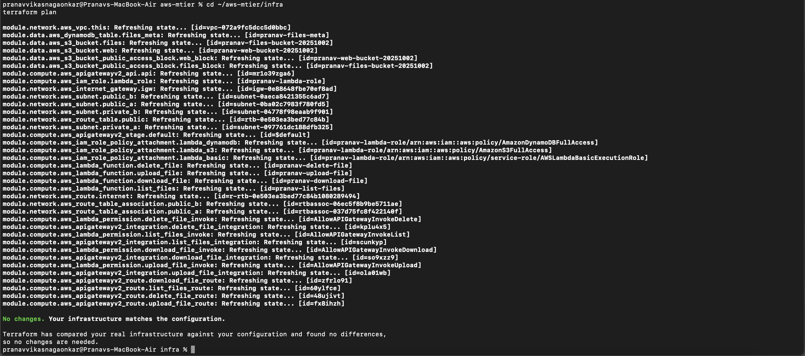
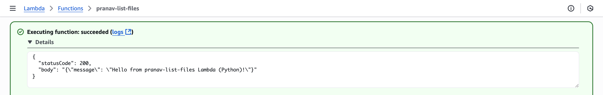
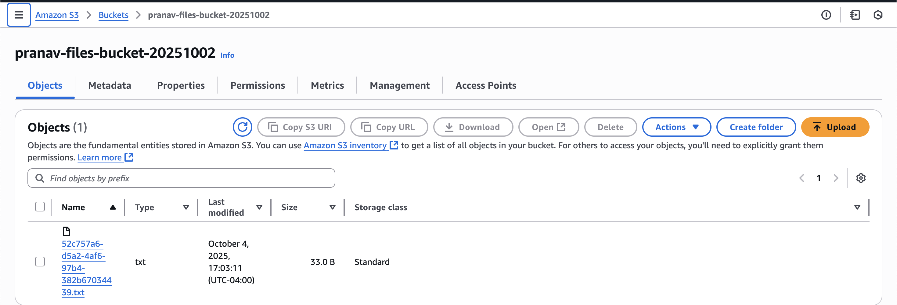
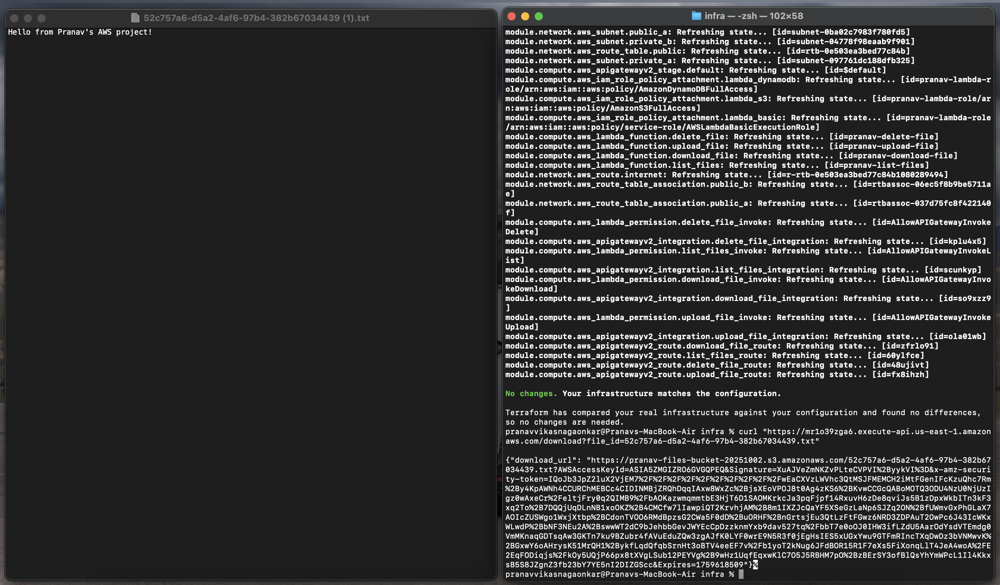
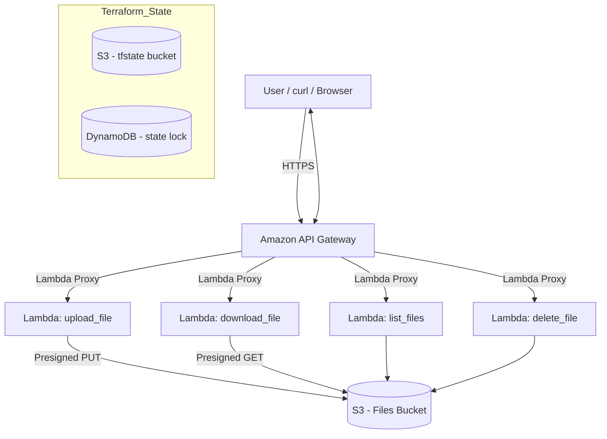

[](https://github.com/nag0ts666/aws-mtier-terraform/actions/workflows/terraform.yml)

# AWS Multi-Tier Serverless Web App (Terraform + Lambda + API Gateway + S3)

This project showcases a **secure, automated, and scalable serverless architecture** built using Terraform and AWS.  
It demonstrates **Infrastructure as Code (IaC)** best practices, **CI/CD automation**, and **serverless application deployment**—ideal for showcasing AWS DevSecOps and architecture skills to recruiters.

**Tech Stack:** Terraform · AWS Lambda · API Gateway · S3 · DynamoDB · IAM · GitHub Actions  

---

## Demo (screenshots)

<p align="center">
  
  
</p>
<p align="center">
  
  
</p>

---

## Try it Yourself

You can test the live API endpoint below to experience how the architecture connects **API Gateway → Lambda → S3** in real time:

```bash
curl https://mr1o39zga6.execute-api.us-east-1.amazonaws.com/list
```
---

## Architecture



---

## Project Structure
aws-mtier-terraform/
│
├── infra/
│   ├── main.tf                  # Main Terraform configuration
│   ├── variables.tf             # Input variables
│   ├── providers.tf             # AWS provider configuration
│   ├── backend.hcl              # Backend state config (S3 + DynamoDB)
│   ├── hello.txt                # Test file for Lambda upload/download
│   ├── .terraform.lock.hcl      # Provider version lock
│   └── modules/                 # Networking, compute, and data modules
│
├── .github/workflows/terraform.yml  # CI/CD automation pipeline
├── .gitignore                       # Ignore .terraform, tfstate, zip files
├── README.md                        # Documentation (this file)

---

